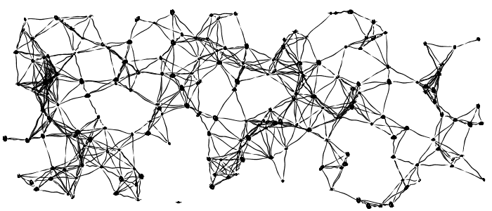
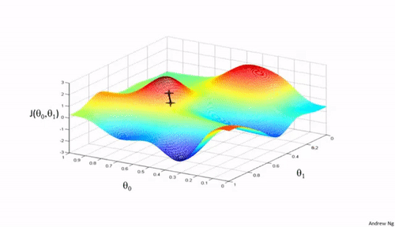
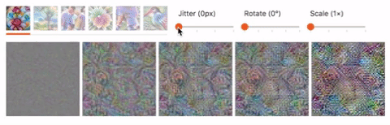

# Machine Learning Resources - Becoming a Machine Learning Expert
From Basic to Advanced

Currently under heavy reconstruction!

- add definitions/ introduction and detailed history of ML (from deep learning book) 

* [Prerequisites Math](#prerequisites-math)
* [Prerequisites Computer Science](#prerequisites-computer-science)
* [1. Basics Machine Learning](#3-prerequisites-programming)
* [2. Advanced Machine Learning](#3-prerequisites-programming)
* [3. Machine Learning Research](#3-prerequisites-programming)
* [Other Resources](#prerequisites-math)

  

## Prerequisites Math: 
Important are Linear Algebra, Probability Theory and Statistics, Regression, Multivariate Calculus, Algorithms and Complex Optimizations. Optional: Random Forest, SVMs, Naive Bayes, Gradient Boosted Methods, PCA:
* [Course: Khan Academy’s - Intro Linear Algebra, Statistics, Calculus](https://www.khanacademy.org/math): Linear Algebra, Probability & Statistics, Multivariable Calculus and Optimization
* [Course: MIT - Linear Algebra](https://ocw.mit.edu/courses/mathematics/18-06-linear-algebra-spring-2010/): linear equations, matrices multiplication, factorization, transposes, permutations, spaces R^n, Column space, nullspace, pivor variables, independence, basis, dimension, fundamental subspaces, graphs networks, incidence matrices, orthogonal vectors, gram-schmidt, properties of determinants, Eigenvalues, eigenvectors, differential equations, Markov matrices, complex matrices, singular value decomposition, linear transformations, pseudoinverse
* [Course: Harvard/Edx - Intro to Statistics](https://www.edx.org/course/introduction-to-probability-0): Approx. 7 weeks to complete - Probability, Counting, and Story Proofs, Conditional Probability and Bayes' Rule, Discrete Random Variables, Continuous Random Variables, Averages, Law of Large Numbers, and Central Limit Theorem, Joint Distributions and Conditional Expectation, Markov Chains
* [Course: Harvard - Statistics and Propability](https://projects.iq.harvard.edu/stat110/youtube): Combinatorics, basic propability, conditional probability, random variables, expected values, condtional expectation, discrete distributions, continous distributions, jointyl distributed random variables, convergence, inequality, markoc chain 
* [Course: Coursera - Mathematics for Machine Learning](https://www.coursera.org/specializations/mathematics-machine-learning): Approx. 2 months to complete - Linear Algebra (Vectors, Matrices), Multivariate Calculus (Multivariate chain rules, Taylor series, linerarisation, optimisation, regression), Principal Component Analysis (Inner Product, Orthogonal Projections)

  

## Prerequisites Computer Science:
Computer Science basics: 

* [Course: MIT/Edx - Introduction to Computer Science and Programming in Python](https://www.edx.org/course/introduction-to-computer-science-and-programming-using-python): Approx. 9 weeks to complete Computation, Branching and iteration, String Manipulation, Guess and Check, Approximations, Bisection, Decomposition, Abstraction, Functions, Tuples, Lists, Aliasing, Mutability, Cloning, Recursion, Dictionaries, Testing, Debugging, Exceptions, Assertions, Object Oriented Programming, Python Classes, Inheritance, Programm Efficiency, Searching, Sorting

Programming languages: Python, NumPy, Octave/Mathlab and R
* [Course: Coursera/RICE - An Introduction to Interactive Programming in Python (Part 1)](https://www.coursera.org/learn/interactive-python-1?specialization=computer-fundamentals): Approx. 29 hours to complete; Statements, expressions, variables, Functions, logic, conditionals, Event-driven programming, local/global variables, canvas, drawing, timers, lists, keyboard input, the basics of modeling motion
* [Course: Coursera/RICE - An Introduction to Interactive Programming in Python (Part 2)](https://www.coursera.org/learn/interactive-python-2?specialization=computer-fundamentals): Approx. 25 hours to complete; mouse input, list methods, dictionaries, classes and object-oriented programming, basic game physics, sprites, sets and animation

Programms: Octave/Mathlab, Jupyter Notebooks, R

Mathlab introduction course

Python Libraries: Numpy, 

* [Numpy](http://www.numpy.org/)
* [Scikit-Learn](http://scikit-learn.org/stable/)
* [Matplotlib](https://matplotlib.org/)
* [Pandas](http://pandas.pydata.org/)
 XGBoost library, visualization: seaborn, matplotlib
 scipy optimizer 

Frameworks: Tensorflow, Keras, Torch, PyTorch, Caffe
https://towardsdatascience.com/deep-learning-framework-power-scores-2018-23607ddf297a

* [Framework: Google (Open Source) - Tensorflow](https://www.tensorflow.org/): Tensorflow is a scalable open-source machine learning library using the programming language python. It is used for both research and production at Google.  
	* [Book: Aurélien Géron - Hands-On Machine Learning with Scikit-Learn and TensorFlow](https://www.amazon.com/dp/1491962291/ref=pd_lpo_sbs_dp_ss_1?pf_rd_p=b4bbef4e-170e-463d-8538-7eff3394b224&pf_rd_s=lpo-top-stripe-1&pf_rd_t=201&pf_rd_i=1617294438&pf_rd_m=ATVPDKIKX0DER&pf_rd_r=1B72PP7FK6A643QXQ1N6&pf_rd_r=1B72PP7FK6A643QXQ1N6&pf_rd_p=b4bbef4e-170e-463d-8538-7eff3394b224)
* [Framework: Francois Chollet (Open Source) - Keras](https://keras.io/): high-level API and open source neural network library written in Python
	* [Book: Francois Chollet - Keras](https://www.amazon.com/Deep-Learning-Python-Francois-Chollet/dp/1617294438)
* [Framework: Torch](http://torch.ch/):open-source machine learning library, writtin in Lua, C, CUDA, C++
* [Framework: PyTorch](http://pytorch.org/): 
* [Framework: Caffe](http://caffe.berkeleyvision.org/) and [Caffe2](https://caffe2.ai/) - Never played around with Caffe, but this was one of the first deep learning libraries out there. Caffe2 is notable because it's the production framework that Facebook uses to serve its models. [According to Soumith Chintala](https://www.oreilly.com/ideas/why-ai-and-machine-learning-researchers-are-beginning-to-embrace-pytorch), researchers at Facebook will try out new models and research ideas using PyTorch and will deploy using Caffe2.
* [Framework: Microsoft (Open Source) - CNTK](https://github.com/Microsoft/CNTK): Microsoft Cognitive Toolkit (CNTK), an open source deep-learning toolkit

* [Framework: Jupyter Notebook](https://jupyter.org/):open-source web application that allows you to create and share documents that contain live code, equations and visualizations.
(https://www.dataquest.io/blog/advanced-jupyter-notebooks-tutorial/)

Automated ML Frameworks:

  

## 1. Basics Machine Learning:

* [Video: 3Blue1Brown - Neural Network Playlist on Neural Networks](https://www.youtube.com/watch?v=aircAruvnKk&list=PLZHQObOWTQDNU6R1_67000Dx_ZCJB-3pi): Building blocks, Gradient descent, Backpropagation

* [Application: Tensorflow - Neural Network Playground](http://playground.tensorflow.org/#activation=tanh&batchSize=10&dataset=circle&regDataset=reg-plane&learningRate=0.03&regularizationRate=0&noise=0&networkShape=4,2&seed=0.09661&showTestData=false&discretize=false&percTrainData=50&x=true&y=true&xTimesY=false&xSquared=false&ySquared=false&cosX=false&sinX=false&cosY=false&sinY=false&collectStats=false&problem=classification&initZero=false&hideText=false): interactive visualization of neural networks

* [Book: Michael Nielsen - Neural Networks and Deep learning](http://neuralnetworksanddeeplearning.com/chap1.html): 

* [Course: Udemy - Deep Learning A-Z™: Hands-On Artificial Neural Networks](https://www.udemy.com/deeplearning/): Artifical Neural Networks, Convolutional Neural Networks, Recurrent Neural Networks, Self Organizing Maps, Boltzmann Machines, AutoEncoders

* [Course: Coursera - Andrew Ng Machine Learning Course](https://www.coursera.org/learn/machine-learning):

* [Course: Udacity - Deep Learning](https://www.udacity.com/course/deep-learning--ud730): Approx. 3 months to complete - basic classification, gradient descent, relus, chain rule, backpropagation, L2 regularization, dropout, hyperparameter tuning, CNN, Word2Vec, tSNE, LSTM

https://hackernoon.com/my-self-created-ai-masters-degree-ddc7aae92d0e

-Machine Learning; Columbia University via edX

- CMU: 2017 Fall: 10-707 Topics in Deep Learning

- Google cloud coursera (3x)
[Spezialisierung, Engineering, Advanced]

- advanced ML https://www.coursera.org/specializations/aml

- https://www.deeplearningbook.org/lecture_slides.html

- Kurs fast.ai
- Machine Learning CS 229 Standford cheatsheets https://stanford.edu/~shervine/teaching/cs-229/

- Tensorflow Tutorial

- Udacity nano degree

Supervised, Unsupervised, Reinforcement learning

Artificial Neural Networks: 
If someone wants to get started with deep learning, I think that the best approach is to first get familiar with machine learning (which you all will have done by this point) and then start with neural networks. Following the same high level understanding -> model specifics -> code -> practical example approach would be great here as well. 

* [How Deep Neural Networks Work](https://www.youtube.com/watch?v=ILsA4nyG7I0): Another great tutorial by Brandon Rohrer.
* [A Friendly Introduction to Deep Learning and Neural Networks](https://www.youtube.com/watch?v=BR9h47Jtqyw): Another visually appearing presentation of neural nets.
 

Convolutional Neural Networks:  
A convolutional neural network is a special type of neural network that has been successfully used for image processing tasks.
* [A Beginner's Guide to Understanding CNNs](https://adeshpande3.github.io/adeshpande3.github.io/A-Beginner's-Guide-To-Understanding-Convolutional-Neural-Networks/): Shameless plug LOL
* [CS 231N Homepage](http://cs231n.github.io/convolutional-networks/): Stanford CS231N is a grad course focused on CNNs that was originally taught by Fei Fei Li, Andrej Karpathy, and others.
* [CS 231N Video Lectures](https://www.youtube.com/playlist?list=PLkt2uSq6rBVctENoVBg1TpCC7OQi31AlC): All the lecture videos from 2016. There will likely be a playlist for 2017 somewhere on YouTube as well. 
* [Brandon Rohrer YouTube Tutorial](https://www.youtube.com/watch?v=FmpDIaiMIeA): Great visuals on this tutorial video. 
* [Andrew Ng's CNN Course](https://www.youtube.com/playlist?list=PLBAGcD3siRDjBU8sKRk0zX9pMz9qeVxud): Videos from Andrew Ng's deep learning course.
* [Stanford CS 231N](https://www.youtube.com/watch?v=g-PvXUjD6qg&list=PLlJy-eBtNFt6EuMxFYRiNRS07MCWN5UIA) - CNNs
their understanding of images
* Visualizing what ConvNets learn Stanford - http://cs231n.github.io/understanding-cnn/
* [Feature Visualization](https://distill.pub/2017/feature-visualization/) - Feature VisualizationHow neural networks build up 
* Visualizing CNN filters with keras (https://jacobgil.github.io/deeplearning/filter-visualizations)

Recurrent Neural Networks:
A recurrent neural network is a special type of neural network that has been successfully used for natural language processing tasks.
* [Deep Learning Research Paper Review: NLP](https://adeshpande3.github.io/adeshpande3.github.io/Deep-Learning-Research-Review-Week-3-Natural-Language-Processing): Too many shameless plugs or nah? LOL
* [CS 224D Video Lectures](https://www.youtube.com/playlist?list=PLCJlDcMjVoEdtem5GaohTC1o9HTTFtK7_): Stanford CS 224D is a grad course focused on RNNs and applying deep learning to NLP. 
* [RNNs and LSTMs](https://www.youtube.com/watch?v=WCUNPb-5EYI): We all love Brandon honestly. 
* [Recurrent Neural Networks - Intel Nervana](https://www.youtube.com/watch?v=Ukgii7Yd_cU): Very comprehensive.
* [Understanding LSTM Networks](http://colah.github.io/posts/2015-08-Understanding-LSTMs/): Chris Olah's posts are readable, yet in-depth.
* [Introduction to RNNs](http://www.wildml.com/2015/09/recurrent-neural-networks-tutorial-part-1-introduction-to-rnns/): Denny Britz is another great author who has a wide ranging blog.

Reinforcement Learning: 
While the 3 prior ML methods are necessarily important for understanding RL, a lot of recent progress in this field has combined elements from the deep learning camp as well as from the traditional reinforcement learning field. 
	* [David Silver's Reinforcement Learning Course](https://www.youtube.com/watch?v=2pWv7GOvuf0&list=PL5X3mDkKaJrL42i_jhE4N-p6E2Ol62Ofa): Advanced stuff covered here, but David is a fantastic lecturer and I loved the comprehensive content. 
	* [Simple Reinforcement Learning with Tensorflow](https://medium.com/emergent-future/simple-reinforcement-learning-with-tensorflow-part-0-q-learning-with-tables-and-neural-networks-d195264329d0): Arthur Juliani has a blog post series that covers RL concepts with lots of practical examples.
	* [David Silver's Reinforcement Learning Course](https://www.youtube.com/watch?v=2pWv7GOvuf0&list=PL5X3mDkKaJrL42i_jhE4N-p6E2Ol62Ofa)
	* [Deep Reinforcement Learning Doesn't Work Yet](https://www.alexirpan.com/2018/02/14/rl-hard.html)
	* [Deep RL Arxiv Review Paper](https://arxiv.org/pdf/1701.07274v2.pdf)
	* [Pong From Pixels](http://karpathy.github.io/2016/05/31/rl/)
	* [Lessons Learned Reproducing a Deep RL Paper](http://amid.fish/reproducing-deep-rl)

Artificial Intelligence:
* Artificial Intelligence Podcast - https://lexfridman.com/ai/

Pretrained Models

  

## 2.1 Advanced Machine Learning: 

* [Course: Coursera - Hintons Neural Networks for Machine Learning](https://www.coursera.org/learn/neural-networks): Approx. 5 weeks to complete - Perceptron, backpropagation, vectors for words, object recogntion, neural nets, optimization, recurrent neural networks, combine multiple neural networks, Hopfield nets, Boltzmann machines, Restricted Boltzman machines (RBMs), Deep Belief Nets, generative pre-training, modeling hierarchical structure

* [Kaggle](http://blog.kaggle.com/): Data-science competitions

### 2.2 Advanced Neuronal Knowledge:
* [Harvard/Edx - Fundamentals of Neuroscience, Part 1: The Electrical Properties of the Neuron](https://www.edx.org/course/fundamentals-of-neuroscience-part-1-the-electrical-properties-of-the-neuron): Approx. 5 weeks to complete - Fundamentals of bioelectricity, resting potential, passive membranes, action potentials, nervous system
* [Harvard/Edx - Fundamentals of Neuroscience, Part 2: Neurons and Networks](https://www.edx.org/course/fundamentals-of-neuroscience-part-2-neurons-and-networks): Approx. 6 weeks to complete - Synapses, neurons communication, interconnected neurons in neuronal circuits, neuromodulation in the firing of synapses

### 2.3 Advanced Mathematical Knowledge:
* [Book: Bishop - Pattern Recognition and Machine Learning](http://users.isr.ist.utl.pt/~wurmd/Livros/school/Bishop%20-%20Pattern%20Recognition%20And%20Machine%20Learning%20-%20Springer%20%202006.pdf): probability theory, decision theory, information theory, probability distributions, binary/multinominal variables, gaussian distribtuion, exponential familiy, nonparametric methods, linear models for regression, bayesian linear regression, evidence approximation, linear models for classification, discrimination functions, probabilistic generative models, laplace approximation, kernel methods, sparse kernal machines

## 3. Machine Learning Research (Go deeper):

https://www.coursera.org/learn/probabilistic-graphical-models

Others:

- Book Aurélien Géron (march 2019)

- Book Santanu Pattanayak Pro Deep Learning with TensorFlow : A Mathematical Approach to Advanced Artificial Intelligence in Python

- Gans in Action: Deep Learning with Generative Adversarial Network (2019)

Multi-layer graphical models/ deep generative models:
- Deep belief networks, 
- Restricted Boltzman machines
- GAN
- graph networks
- gaussian process models for hyper parameters (hyperparameter search)
-genetic algorithms, evolution strategies, reinforcement learning
-depthwise separable convolutions
- neural turing machine (deepmind)
encode: One-hot encode, k-hot encode (mathematical idea)
loss: crossentropy, mean square error, absolut error (mathematical idea)

## Other Courses
-delet courses or add them to other sections
* [Stanford CS 224D](https://www.youtube.com/watch?v=sU_Yu_USrNc&list=PLTuSSFCVeNVCXL0Tak5rJ83O-Bg_ajO5B) - Deep Learning for NLP
* [Hugo Larochelle's Neural Networks Course](https://www.youtube.com/watch?v=SGZ6BttHMPw&list=PL6Xpj9I5qXYEcOhn7TqghAJ6NAPrNmUBH)
* [Stanford CS 229](https://www.youtube.com/playlist?list=PLA89DCFA6ADACE599) - Pretty much the same as the Coursera course
* [UC Berkeley Kaggle Decal](https://kaggledecal.github.io/)
* [Short MIT Intro to DL Course](https://www.youtube.com/playlist?list=PLkkuNyzb8LmxFutYuPA7B4oiMn6cjD6Rs)

* [Deep Learning School Montreal 2016](http://videolectures.net/deeplearning2016_montreal/) and [2017](http://videolectures.net/deeplearning2017_montreal/)
* [Intro to Neural Nets and ML (Univ of Toronto)](http://www.cs.toronto.edu/~rgrosse/courses/csc321_2017/)
* [Deep RL Bootcamp](https://sites.google.com/view/deep-rl-bootcamp/lectures)
* [CMU Neural Networks for NLP](http://www.phontron.com/class/nn4nlp2017/schedule.html)
* [Bay Area Deep Learning School Day 1 2016](https://www.youtube.com/watch?v=eyovmAtoUx0) and [Day 2](https://www.youtube.com/watch?v=9dXiAecyJrY)
* [Introduction to Deep Learning MIT Course](https://www.youtube.com/playlist?list=PLkkuNyzb8LmxFutYuPA7B4oiMn6cjD6Rs)
* [Caltech CS 156 - Machine Learning](https://www.youtube.com/playlist?list=PLD63A284B7615313A)
* [Berkeley EE 227C - Convex Optimization](https://ee227c.github.io/)

## Deep Learning Paper
Personally I would always prefer one book over 50 paper. But often you are unable to find a book as updated as a paper, then there is no way around. And if you know what you are looking for it’s nice.

2018 analysis: http://flip.it/SNv6ek
top paper 2018: https://www.techleer.com/articles/517-a-list-of-top-10-deep-learning-papers-the-2018-edition/
review pf the last 20 years: https://www.technologyreview.com/s/612768/we-analyzed-16625-papers-to-figure-out-where-ai-is-headed-next/

* [Arxiv](https://arxiv.org/):  a repository of electronic preprints (known as e-prints)
* [Arxiv Sanity](http://arxiv-sanity.com): Web interface for browsing, search and filtering recent arxiv submissions
* [Paperscape](http://paperscape.org):  Paperscape is an interactive map that visualises the arXiv
* [AlexNet](https://papers.nips.cc/paper/4824-imagenet-classification-with-deep-convolutional-neural-networks.pdf)
* [GoogLeNet](https://arxiv.org/pdf/1409.4842v1.pdf)
* [VGGNet](https://arxiv.org/pdf/1409.1556v6.pdf)
* [ZFNet](https://arxiv.org/pdf/1311.2901v3.pdf)
* [ResNet](https://arxiv.org/pdf/1512.03385.pdf)
* [R-CNN](https://arxiv.org/pdf/1311.2524v5.pdf)
* [Fast R-CNN](https://arxiv.org/pdf/1504.08083.pdf)
* [Adversarial Images](https://arxiv.org/pdf/1412.1897.pdf)
* [Generative Adversarial Networks](https://arxiv.org/pdf/1406.2661v1.pdf)
* [Spatial Transformer Networks](https://arxiv.org/pdf/1506.02025.pdf)
* [DCGAN](https://arxiv.org/pdf/1511.06434v2.pdf)
* [Synthetic Gradients](https://arxiv.org/pdf/1608.05343v1.pdf)
* [Memory Networks](https://arxiv.org/pdf/1410.3916v11.pdf)
* [Mixture of Experts](https://arxiv.org/pdf/1701.06538.pdf)
* [Neural Turing Machines](https://arxiv.org/pdf/1410.5401.pdf)
* [Alpha Go](https://storage.googleapis.com/deepmind-media/alphago/AlphaGoNaturePaper.pdf)
* [Atari DQN](https://www.cs.toronto.edu/~vmnih/docs/dqn.pdf)
* [Word2Vec](https://arxiv.org/pdf/1310.4546.pdf)
* [GloVe](https://nlp.stanford.edu/pubs/glove.pdf)
* [A3C](https://arxiv.org/pdf/1602.01783v2.pdf)
* [Gradient Descent by Gradient Descent](https://arxiv.org/pdf/1606.04474v1.pdf)
* [Rethinking Generalization](https://arxiv.org/pdf/1611.03530v1.pdf)
* [Densely Connected CNNs](https://arxiv.org/pdf/1608.06993v1.pdf)
* [EBGAN](https://arxiv.org/pdf/1609.03126v1.pdf)
* [Wasserstein GAN](https://arxiv.org/pdf/1701.07875.pdf)
* [Style Transfer](https://arxiv.org/pdf/1603.08155v1.pdf)
* [Pixel RNN](https://arxiv.org/pdf/1601.06759v2.pdf)
* [Dynamic Coattention Networks](https://arxiv.org/pdf/1611.01604v2.pdf)
* [Convolutional Seq2Seq Learning](https://arxiv.org/pdf/1705.03122.pdf)
* [Seq2Seq](https://arxiv.org/pdf/1409.3215.pdf)
* [Dropout](https://www.cs.toronto.edu/~hinton/absps/JMLRdropout.pdf)
* [Batch Norm](https://arxiv.org/pdf/1502.03167.pdf)
* [Large Batch Training](https://arxiv.org/pdf/1609.04836.pdf)
* [Transfer Learning](http://papers.nips.cc/paper/5347-how-transferable-are-features-in-deep-neural-networks.pdf)
* [Adam](https://arxiv.org/pdf/1412.6980.pdf)
* [Speech Recognition](https://arxiv.org/pdf/1303.5778.pdf)
* [Relational Networks](https://arxiv.org/pdf/1706.01427.pdf)
* [Influence Functions](https://arxiv.org/pdf/1703.04730.pdf)
* [ReLu](https://arxiv.org/pdf/1611.01491.pdf)
* [Xavier Initialization](http://proceedings.mlr.press/v9/glorot10a/glorot10a.pdf)
* [Saddle Points and Non-convexity of Neural Networks](https://arxiv.org/pdf/1406.2572.pdf)
* [Overcoming Catastrophic Forgetting in NNs](https://arxiv.org/pdf/1612.00796.pdf)
* [Quasi-Recurrent Neural Networks](https://arxiv.org/pdf/1611.01576.pdf)
* [Escaping Saddle Points Efficiently](https://arxiv.org/pdf/1703.00887.pdf)
* [Progressive Growing of GANs](http://research.nvidia.com/sites/default/files/pubs/2017-10_Progressive-Growing-of//karras2017gan-paper.pdf)
* [Attention is All You Need](https://arxiv.org/pdf/1706.03762.pdf)
* [Dynamic Routing Between Capsules](https://arxiv.org/pdf/1710.09829.pdf)
* [Unsupervised Machine Translation with Monolingual Corpora](https://arxiv.org/pdf/1711.00043.pdf)
* [Population Based Training of NN's](https://arxiv.org/pdf/1711.09846.pdf)
* [Learned Index Structures](https://arxiv.org/pdf/1712.01208v1.pdf)
* [Visualizing Loss Landscapes](https://arxiv.org/pdf/1712.09913v1.pdf)
* [DenseNet](https://arxiv.org/pdf/1608.06993.pdf)
* [SqueezeNet](https://arxiv.org/pdf/1602.07360.pdf)
* [WaveNet](https://arxiv.org/pdf/1609.03499.pdf)
* [Hidden Technical Debt in ML Systems](https://papers.nips.cc/paper/5656-hidden-technical-debt-in-machine-learning-systems.pdf)
* [MobileNets](https://arxiv.org/pdf/1704.04861.pdf)
* [Learning from Imbalanced Data](http://www.ele.uri.edu/faculty/he/PDFfiles/ImbalancedLearning.pdf)
* Information theory and machine learning (https://export.arxiv.org/abs/1808.07593)

## Other Resources 

* [Book: The Master Algorithm - Petro Domingos](https://www.amazon.de/Master-Algorithm-Ultimate-Learning-Machine/dp/0141979240/ref=sr_1_1?ie=UTF8&qid=1538107975&sr=8-1&keywords=master+algorithm): Symbolists (rule System, inverse deduction), Connectionsis (backpropagation, deep learnin), Bayesians (HMM, graphical model), Evolutionaries (genetic algorithms, evolutionary programming), Analogizer (kNN, SVM)
* [Book: Life 3.0: Being Human in the Age of Artificial Intelligence - Max Tegmark](https://www.amazon.de/Life-3-0-Being-Artificial-Intelligence/dp/0141981806/ref=sr_1_1?s=books-intl-de&ie=UTF8&qid=1540382287&sr=1-1&keywords=tegmark): implications of AI, future AGI

#### People to follow:

* [Yann LeCun](http://yann.lecun.com/): Director of AI Research, Facebook and Founding Director of the NYU Center for Data Science
* [Andrew NG](https://www.andrewng.org/): founder of Coursera, led Google Brain and was a former Chief Scientist at Baidu
* [Geoffrey Hinton](www.cs.toronto.edu/~hinton/):Professor at University of Toronto and Research Scientist at the Google Brain
* [Pieter Abbeel](people.eecs.berkeley.edu/~pabbeel/): Professor, UC Berkeley, EECS, BAIR, CHCAI and Research Scientist OpenAI
* [Andrej Karpathy](http://karpathy.github.io/): director of artificial intelligence and Autopilot Vision at Tesla
* [Neil Lawrence](http://inverseprobability.com/blog): Professor of Machine Learning at the University of Sheffield
* [Moritz Hardt](http://blog.mrtz.org/): Assistant Professor in Electrical Engineering and Computer Sciences University of California
* [Yoshua Bengio](www.iro.umontreal.ca/~bengioy/yoshua_en/):  Professor Department of Computer Science and Operations Research Canada Research
* [Jürgen Schmidhuber](www.idsia.ch/~juergen/): co-director of the Dalle Molle Institute for Artificial Intelligence Research in Manno
* [Ian Goodfellow](https://github.com/goodfeli): Research scientist at Google Brain
* [Ilya Sutskever](www.cs.toronto.edu/~ilya/): Chief scientist of OpenAI, coinventor of AlexNet
* [Wojciech Zaremba](wojzaremba.com/): Head of Robotics research at OpenAI
* [Fei-Fei Li](vision.stanford.edu/feifeili/): Professor at the Computer Science Department at Stanford University
* [Demis Hassabi](https://twitter.com/demishassabis?ref_src=twsrc%5Egoogle%7Ctwcamp%5Eserp%7Ctwgr%5Eauthor): Cofounder of renowned artificial intelligence (AI) lab DeepMind
* [Vladimir Vapnik](https://datascience.columbia.edu/vladimir-vapnik): Co-inventor of the support vector machine method, and support vector clustering algorithm
* [Michael I. Jordan](https://people.eecs.berkeley.edu/~jordan/): Professor at the University of California, Berkeley
* [Christopher M. Bishop](https://www.microsoft.com/en-us/research/people/cmbishop/): Laboratory Director at Microsoft Research Cambridge
* [Zoubin Ghahramani](http://mlg.eng.cam.ac.uk/zoubin/): Professor at Cambridge, the Alan Turing Institute and Chief Scientist of Uber
* [Yoshua Bengio](http://www.iro.umontreal.ca/~bengioy/yoshua_en/): Full Professor CS, head of the Machine Learning Laboratory, Montreal
* [Ruslan Salakhutdinov](http://www.cs.cmu.edu/~rsalakhu/): Director of AI research at Apple and Professor of computer science in Mellon
* [Yuanqing Lin](https://cn.linkedin.com/in/yuanqing-lin-8666789): Former Head of Baidu Research, now at AI startup Aibee.ai
* [Jeff Dean](https://ai.google/research/people/jeff): Lead of Google.ai
* [Pete Warden](https://petewarden.com/page/2/): Lead of the TensorFlow Mobile/Embedded team
* [Sebastian Ruder](http://ruder.io/#open): PhD Student in Natural Language Processing and Deep Learning
* richard socher

#### Companies to follow:
* [Google Research](https://research.googleblog.com/): Research department from Google
* [Google Brain](https://ai.google/research/teams/brain): deep learning artificial intelligence research team at Google
* [Deepmind](https://deepmind.com/blog/): Solve intelligence, use it to make the world a better place (company from Google)
* [Waymo](https://waymo.com/tech/): develop machine learning solutions addressing open problems in autonomous driving
* [Facebook AI Research](https://research.fb.com/blog/): Research Unit from Facebook
* [Qure.ai](http://blog.qure.ai/): AI for Radiology
* [Baidu](http://research.baidu.com/): specializing in Internet-related services and products and artificial intelligence
* [Alibaba](https://damo.alibaba.com/labs/ai): specializing in e-commerce, retail, Internet, AI and technology
* [Apple Research](https://machinelearning.apple.com/): Research department from Apple
* [Vicarious](https://www.vicarious.com): using the theorized computational principles of the brain to build software
* [Salesforce Research](https://www.salesforce.com/products/einstein/ai-research/): cloud-based software company 
* [Tencent](https://ai.tencent.com/ailab/index.html): AI lab in Shenzhen with a vision to “Make AI Everywhere"
* [Wechat](https://ai.weixin.qq.com): Chinese multi-purpose messaging, social media and mobile payment app 
* [QQ](https://ai.qq.com): instant messaging software service developed by the Chinese company Shenzhen Tencent
* [Uber](https://eng.uber.com/tag/uber-ai-labs/): Uber AI Labs
* [OpenAI](https://blog.openai.com/): Company founded by Elon Musk for AI safety
* [Amazon](https://aws.amazon.com/de/blogs/machine-learning/): Research Blog from Amazon
* [Microsoft](https://www.microsoft.com/en-us/research/): Research department from Mircosoft
* [Bostondynamics](https://www.bostondynamics.com): American engineering and robotics design company

#### Universitys to follow:

* [MIT](https://www.csail.mit.edu): MIT Computer Science & Artificial Intelligence Lab
* [Standfort](http://ai.stanford.edu): Stanford Artificial Intelligence Laboratory
* [Cambridge](http://mlg.eng.cam.ac.uk): Cambridge Machine Learning Group
* [Caltech](http://www.cns.caltech.edu): Computation & Neural Systems
Toronto
* [Berkeley AI Research](http://bair.berkeley.edu/blog/): Berkeley Artificial Intelligence Research
* [Berkeley ML Research](https://ml.berkeley.edu/blog/): Machine Learning at Berkeley
China
Paris

#### Blogs etc. to follow:
* [Website: Lab41](https://gab41.lab41.org/tagged/machine-learning): Lab41's blog exploring data science, machine learning, and artificial intelligence
* [Website: The Gradient](https://thegradient.pub/): A digital publication about artificial intelligence and the future
* [Website: Off the Convex Path](http://www.offconvex.org/about/): technical blog about machine learning
* [Website: Distill](https://distill.pub/): Latest articles about machine learning
* [Website: Towards Data Science](https://towardsdatascience.com/): Sharing concepts, ideas, and codes
* [Website: TOP500](https://www.top500.org): TOP500 List of the world’s fastest supercomputers
Top500 computer
* [Podcast: Learning Machines 101](https://www.learningmachines101.com): A Gentle Introduction to Artificial Intelligence
* [Podcast: Datasceptic](https://dataskeptic.com): Data science, statistics, machine learning, artificial intelligence, and scientific skepticism

Credits: Big thanks to all contributors to awesome lists (posted in other resources), which enabled me to find some of the courses contained in the list.
 

